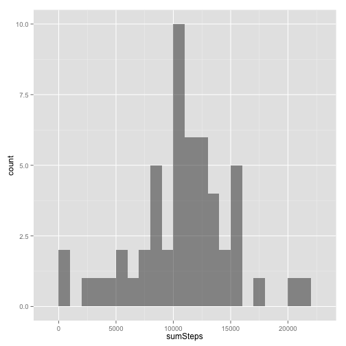
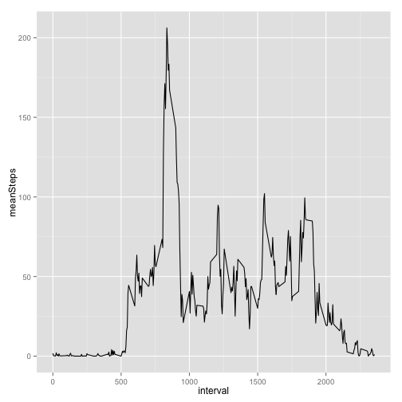
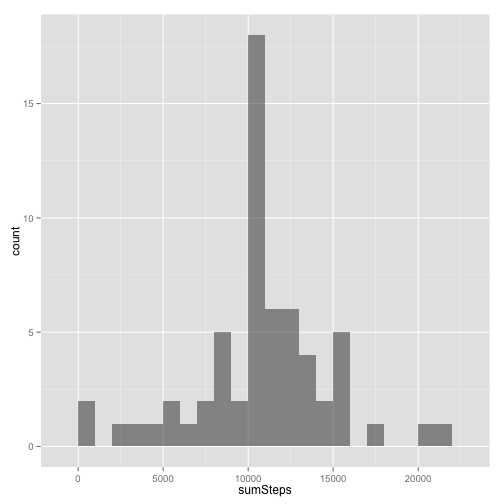
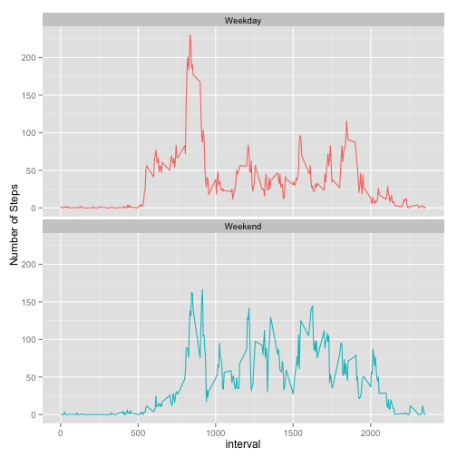

========================================================

# Reproducible Research: Peer Assessment 1

## Loading and preprocessing the data
Read the CSV file. 

Convert the data frame to a data table using the [`data.table`]. 

Convert the "date" variable to a "date class".


```r
library(data.table)
dt <- read.csv(file.path(getwd(), "activity.csv"))
dt <- data.table(dt)
dt <- dt[, date := as.Date(date)]
```
## What is mean total number of steps taken per day?

Aggregate the number of steps taken each day.
Days with missing values (`NA`) will have `NA` when aggregated.


```r
dtDailySteps <- dt[, list(sumSteps = sum(steps)), date]
head(dtDailySteps)
```

```
##          date sumSteps
## 1: 2012-10-01       NA
## 2: 2012-10-02      126
## 3: 2012-10-03    11352
## 4: 2012-10-04    12116
## 5: 2012-10-05    13294
## 6: 2012-10-06    15420
```
Plot a histogram of the total number of steps taken each day.


```r
library(ggplot2)
ggplot(dtDailySteps, aes(x=sumSteps)) +
  geom_histogram(alpha=1/2, binwidth=1000)
```

 

Calculate the mean and median total number of steps taken per day.


```r
dtDailySteps[, list(mean = mean(sumSteps, na.rm=TRUE), median = median(sumSteps, na.rm=TRUE))]
```

    mean median
1: 10766  10765

## What is the average daily activity pattern?
Aggregate the average number of steps taken by 5-minute interval.


```r
dtIntervals <- dt[, list(meanSteps = mean(steps, na.rm=TRUE)), interval]
```
- Time series plot of the 5-minute interval and the average number of steps taken across all days.
- Which 5 minute interval contains maximum # of steps?


```r
ggplot(dtIntervals, aes(x=interval, y=meanSteps)) +
  geom_line()
```

 

```r
maxInt <- dtIntervals[which.max(meanSteps),interval]
```

**The interval containing, on average, the maximum number of steps is 835.**

## Imputing missing values

Note that there are a number of days/intervals where there are missing values (coded as `NA`). The presence of missing days may introduce bias into some calculations or summaries of the data.
 
- Calculate and report the total number of missing values in the dataset (i.e. the total number of rows with `NA`s)


```r
missrows <- sum(is.na(dt))
```
**A total of 2304 rows contain missing values.**

- Devise a strategy for filling in all of the missing values in the dataset. The strategy does not need to be sophisticated. For example, you could use the mean/median for that day, or the mean for that 5-minute interval, etc.

The strategy is to replace the missing values with observed mean for that interval. 

- Create a new dataset that is equal to the original dataset but with the missing data filled in.


```r
naDt <- data.table(dt,key="interval")
fillDt <- data.table(dtIntervals, key="interval")
mergedDt <- naDt[fillDt]
mergedDt[is.na(steps), steps:=meanSteps]
newDt <- mergedDt[,list(interval, steps, date)]
```

 
- Make a histogram of the total number of steps taken each day and Calculate and report the **mean** and **median** total number of steps taken per day. Do these values differ from the estimates from the first part of the assignment? What is the impact of imputing missing data on the estimates of the total daily number of steps?


```r
## Aggregate imputed data by day
newDtDailySteps <- newDt[, list(sumSteps = sum(steps)), date]
ggplot(newDtDailySteps, aes(x=sumSteps)) +
  geom_histogram(alpha=1/2, binwidth=1000)
```

 

```r
newMean <- mean(newDtDailySteps$sumSteps,na.rm=TRUE)
newMedian <- median(newDtDailySteps$sumSteps,na.rm=TRUE)
```

**The mean and median number of steps per day are 10750 and 10641 respectively.**

After imputing "NA" values, the mean and median both are less than before.The overall impact of the imputed values is to **lower** the estimates of the number of steps taken each day.

## Are there differences in activity patterns between weekdays and weekends?
#*Weekday/Weekend Differences*

```r
newDt$dayType <- as.factor(ifelse(weekdays(newDt$date) %in% c("Saturday","Sunday"), "Weekend", "Weekday"))
newDtIntervals <- newDt[, list(meanSteps = mean(steps, na.rm=TRUE)), list(dayType, interval)]
ggplot(newDtIntervals, aes(x=interval, y=meanSteps, color=dayType)) +
  geom_line() +
  facet_wrap(~ dayType, nrow=2) +
	theme(legend.position="none") +ylab("Number of Steps")
```

 
