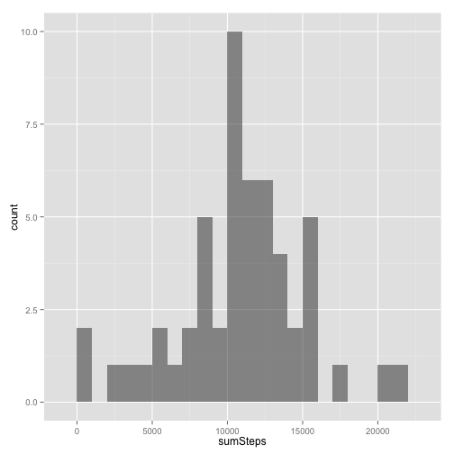
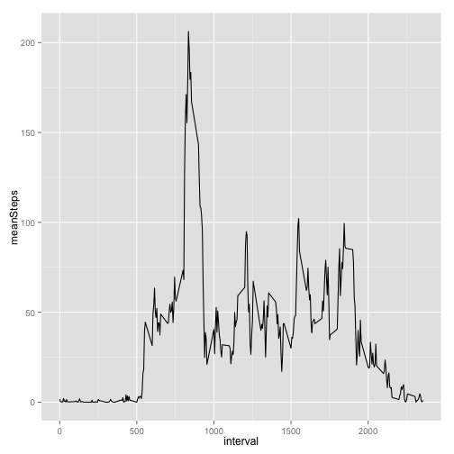

# Reproducible Research: Peer Assessment 1


## Loading and preprocessing the data
Read the CSV file.
Convert the data frame to a data table using the [`data.table`]
Convert the "date" variable to a "date class".


```r
library(data.table)
dt <- read.csv(file.path(getwd(), "activity.csv"))
dt <- data.table(dt)
dt <- dt[, date := as.Date(date)]
```


## What is mean total number of steps taken per day?

Aggregate the number of steps taken each day.
Days with missing values (`NA`) will have `NA` when aggregated.


```r
dtDailySteps <- dt[, list(sumSteps = sum(steps)), date]
head(dtDailySteps)
```

```
##          date sumSteps
## 1: 2012-10-01       NA
## 2: 2012-10-02      126
## 3: 2012-10-03    11352
## 4: 2012-10-04    12116
## 5: 2012-10-05    13294
## 6: 2012-10-06    15420
```

Plot a histogram of the total number of steps taken each day.


```r
library(ggplot2)
ggplot(dtDailySteps, aes(x=sumSteps)) +
  geom_histogram(alpha=1/2, binwidth=1000)
```

 

Calculate the mean and median total number of steps taken per day **before imputing**.


```r
dtDailySteps[, list(mean = mean(sumSteps, na.rm=TRUE), median = median(sumSteps, na.rm=TRUE))]
```

    mean median
1: 10766  10765


## What is the average daily activity pattern?
Aggregate the average number of steps taken by 5-minute interval.


```r
dtIntervals <- dt[, list(meanSteps = mean(steps, na.rm=TRUE)), interval]
```

- Time series plot of the 5-minute interval and the average number of steps taken across all days.
- Which 5 minute interval contains maximum # of steps?


```r
ggplot(dtIntervals, aes(x=interval, y=meanSteps)) +
	geom_line()
```

 

```r
maxInt <- dtIntervals[which(dtIntervals$meanSteps==max(dtIntervals$meanSteps)),]$interval	
```


## Imputing missing values
