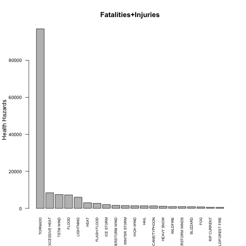

Impact analysis of weather events on population health and economy in US
==========================================================================
## Synopsis

This analysis report presents the impacts of storms and weather events on the population health and economy. We used the data published by The U.S. National Oceanic and Atmospheric Administration's (NOAA) [storm database](https://d396qusza40orc.cloudfront.net/repdata%2Fdata%2FStormData.csv.bz2). We analyzed the number of fatalities and injuries and the dollar amount of property and crop damages of the significant catastrophical events. In the end, we illustrate the impact of different types of events on human health (fatalities and injuries), property damage and crop damage using barcharts. We found that the tornado is most harmful for population health, and the flash flood results in the greatest loss on economic value.

## Data Processing

### Load Packages


```r
packages <- c("data.table", "ggplot2")
sapply(packages, require, character.only=TRUE, quietly=TRUE)
```

```
## data.table    ggplot2 
##       TRUE       TRUE
```

### Read data file

The data file (CSV format) is in the working directory.
Read the CSV file as a data frame.
Then convert to a data table.


```r
f <- file.path(getwd(), "repdata-data-StormData.csv.bz2")
con <- bzfile(f)
dt <- read.csv(con, stringsAsFactors=FALSE)
dt <- data.table(dt)
str(dt)
```

```
## Classes 'data.table' and 'data.frame':	902297 obs. of  37 variables:
##  $ STATE__   : num  1 1 1 1 1 1 1 1 1 1 ...
##  $ BGN_DATE  : chr  "4/18/1950 0:00:00" "4/18/1950 0:00:00" "2/20/1951 0:00:00" "6/8/1951 0:00:00" ...
##  $ BGN_TIME  : chr  "0130" "0145" "1600" "0900" ...
##  $ TIME_ZONE : chr  "CST" "CST" "CST" "CST" ...
##  $ COUNTY    : num  97 3 57 89 43 77 9 123 125 57 ...
##  $ COUNTYNAME: chr  "MOBILE" "BALDWIN" "FAYETTE" "MADISON" ...
##  $ STATE     : chr  "AL" "AL" "AL" "AL" ...
##  $ EVTYPE    : chr  "TORNADO" "TORNADO" "TORNADO" "TORNADO" ...
##  $ BGN_RANGE : num  0 0 0 0 0 0 0 0 0 0 ...
##  $ BGN_AZI   : chr  "" "" "" "" ...
##  $ BGN_LOCATI: chr  "" "" "" "" ...
##  $ END_DATE  : chr  "" "" "" "" ...
##  $ END_TIME  : chr  "" "" "" "" ...
##  $ COUNTY_END: num  0 0 0 0 0 0 0 0 0 0 ...
##  $ COUNTYENDN: logi  NA NA NA NA NA NA ...
##  $ END_RANGE : num  0 0 0 0 0 0 0 0 0 0 ...
##  $ END_AZI   : chr  "" "" "" "" ...
##  $ END_LOCATI: chr  "" "" "" "" ...
##  $ LENGTH    : num  14 2 0.1 0 0 1.5 1.5 0 3.3 2.3 ...
##  $ WIDTH     : num  100 150 123 100 150 177 33 33 100 100 ...
##  $ F         : int  3 2 2 2 2 2 2 1 3 3 ...
##  $ MAG       : num  0 0 0 0 0 0 0 0 0 0 ...
##  $ FATALITIES: num  0 0 0 0 0 0 0 0 1 0 ...
##  $ INJURIES  : num  15 0 2 2 2 6 1 0 14 0 ...
##  $ PROPDMG   : num  25 2.5 25 2.5 2.5 2.5 2.5 2.5 25 25 ...
##  $ PROPDMGEXP: chr  "K" "K" "K" "K" ...
##  $ CROPDMG   : num  0 0 0 0 0 0 0 0 0 0 ...
##  $ CROPDMGEXP: chr  "" "" "" "" ...
##  $ WFO       : chr  "" "" "" "" ...
##  $ STATEOFFIC: chr  "" "" "" "" ...
##  $ ZONENAMES : chr  "" "" "" "" ...
##  $ LATITUDE  : num  3040 3042 3340 3458 3412 ...
##  $ LONGITUDE : num  8812 8755 8742 8626 8642 ...
##  $ LATITUDE_E: num  3051 0 0 0 0 ...
##  $ LONGITUDE_: num  8806 0 0 0 0 ...
##  $ REMARKS   : chr  "" "" "" "" ...
##  $ REFNUM    : num  1 2 3 4 5 6 7 8 9 10 ...
##  - attr(*, ".internal.selfref")=<externalptr>
```

### Clean Data

List the number of unique values of `evtype`.


```r
message(sprintf("Number of unique values of evtype: %.0d", length(unique(dt$EVTYPE))))
```

```
## Number of unique values of evtype: 985
```

Since there are a large number of unique event types, the top 20 events are considered for each scenario.

Create a subset of the data with the needed attributes

```r
stormDt <- dt[,c("EVTYPE","FATALITIES","INJURIES","PROPDMG","PROPDMGEXP","CROPDMG","CROPDMGEXP")]
```

Calculate the total number of fatalities and injuries

```r
stormDt$TOTAL_INCIDENTS <- stormDt$FATALITIES + stormDt$INJURIES
```

Aggregate the total incidents per event type and pick the top 20.

```r
stormDtHealthHazards <- stormDt[, list(HEALTH_HAZARDS = sum(TOTAL_INCIDENTS)),EVTYPE]
top20HealthHazards <- stormDtHealthHazards[order(stormDtHealthHazards$HEALTH_HAZARDS, decreasing = TRUE), ][1:20, ]
```

Convert the PROPDMGEXP and CROPDMGEXP into number as below: 
- B - Billion, M - Million, K - 1000, H - 100, all others = 1

**Property Damage:** Calculate the PROPDMG_VALUE as PROPDMG * PROPDMGEXP; Aggregate PROPDMG_VALUE per event type and pick the top 20.

**Crop Damage:** Calculate the CROPDMG_VALUE as CROPDMG * CROPDMGEXP; Aggregate CROPDMG_VALUE per event type and pick the top 20.

```r
stormDt$PROPDMGEXP[stormDt$PROPDMGEXP == "B"] <- 1e+09
stormDt$PROPDMGEXP[stormDt$PROPDMGEXP == "h"] <- 100
stormDt$PROPDMGEXP[stormDt$PROPDMGEXP == "H"] <- 100
stormDt$PROPDMGEXP[stormDt$PROPDMGEXP == "K"] <- 1000
stormDt$PROPDMGEXP[stormDt$PROPDMGEXP == "m"] <- 1e+06
stormDt$PROPDMGEXP[stormDt$PROPDMGEXP == "M"] <- 1e+06
stormDt$PROPDMGEXP[!stormDt$PROPDMGEXP %in% c("M","m","K","H","h","B")] <- 1
  
stormDt$CROPDMGEXP[stormDt$CROPDMGEXP == "B"] <- 1e+09
stormDt$CROPDMGEXP[stormDt$CROPDMGEXP == "K"] <- 1000
stormDt$CROPDMGEXP[stormDt$CROPDMGEXP == "m"] <- 1e+06
stormDt$CROPDMGEXP[stormDt$CROPDMGEXP == "M"] <- 1e+06
stormDt$CROPDMGEXP[!stormDt$CROPDMGEXP %in% c("M","m","K","B")] <- 1

stormDt$totalpropdamage <- as.numeric(stormDt$PROPDMGEXP) * (stormDt$PROPDMG)
totalPropDmg <- aggregate(stormDt$totalpropdamage, by = list(stormDt$EVTYPE), sum)
totalPropDmg <- stormDt[, list(PROPDMG_VALUE = sum(totalpropdamage)),EVTYPE]
top20PropDmg <- totalPropDmg[order(totalPropDmg$PROPDMG_VALUE, decreasing = TRUE, na.last = NA), ][1:20, ]


stormDt$totalcropdamage <- as.numeric(stormDt$CROPDMGEXP) * stormDt$CROPDMG
totalCropDmg <- aggregate(stormDt$totalcropdamage, by = list(stormDt$EVTYPE), 
    sum)
totalCropDmg <- stormDt[, list(CROPDMG_VALUE = sum(totalcropdamage)),EVTYPE]

top20CropDmg <- totalCropDmg[order(totalCropDmg$CROPDMG_VALUE, decreasing = TRUE, na.last = NA), ][1:20, ]
```

## Results

```r
barplot(top20HealthHazards$HEALTH_HAZARDS, names.arg = top20HealthHazards$EVTYPE, main = "Fatalities+Injuries", ylab = "Health Hazards", cex.axis = 0.8, cex.names = 0.6, las = 2)
```

 

The above chart clearly indicates the top 20 events that greatly impact the population health. **Tornado affects the population health the most.**


```r
barplot(top20PropDmg$PROPDMG_VALUE/10^6, names.arg = top20PropDmg$EVTYPE, main = "Property Damages", ylab = "Property Damage in millions", cex.axis = 0.8, cex.names = 0.6, las = 2)
```

 

The above chart displays the top 20 events that have inflicted property damage. **Tornado creates the maximum property damage.**


```r
barplot(top20CropDmg$CROPDMG_VALUE/10^6, names.arg = top20CropDmg$EVTYPE, main = "Crop Damages", ylab = "Crops Damage in million", cex.axis = 0.8, cex.names = 0.6, las = 2)
```

 

The above chart displays the top 20 events that have inflicted crop damage. **Hail creates the maximum crop damage.**

## End of Analysis
