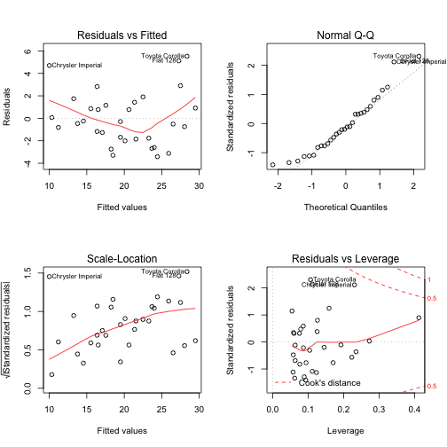

What gives better mileage? Automatic or Manual transmission
========================================================

# Executive summary
    
In this report, we examine the dataset from 1974 Motor Trend US magazine to determine the effect of transmission type on miles per gallon (mpg). Manual tranmission type gives higher mpg as can be clearly seen in the boxplot shown in Figure 1. We conducted a t-test for the difference between mean mpg of automatic and manual transmission cars. At 95% confidence interval, it is observed that there is a difference in mean of about 7 miles more for the manual transmitted cars.

We then quantified the difference in mpg between automatic and manual transmissions using a liner regression model. This model shows that a manual transmission increases the expected mpg by about 2.3 miles when all the other factors are kept constant. It is alsoe clear that hp and wt has a bigger impact on mpg than the transmission type.

## Cleaning data

Load and look at data


```r
data(mtcars)
str(mtcars)
```

```
## 'data.frame':	32 obs. of  11 variables:
##  $ mpg : num  21 21 22.8 21.4 18.7 18.1 14.3 24.4 22.8 19.2 ...
##  $ cyl : num  6 6 4 6 8 6 8 4 4 6 ...
##  $ disp: num  160 160 108 258 360 ...
##  $ hp  : num  110 110 93 110 175 105 245 62 95 123 ...
##  $ drat: num  3.9 3.9 3.85 3.08 3.15 2.76 3.21 3.69 3.92 3.92 ...
##  $ wt  : num  2.62 2.88 2.32 3.21 3.44 ...
##  $ qsec: num  16.5 17 18.6 19.4 17 ...
##  $ vs  : num  0 0 1 1 0 1 0 1 1 1 ...
##  $ am  : num  1 1 1 0 0 0 0 0 0 0 ...
##  $ gear: num  4 4 4 3 3 3 3 4 4 4 ...
##  $ carb: num  4 4 1 1 2 1 4 2 2 4 ...
```

Convert "cyl", "vs", "am", gear", "carb" variables into factors.


```r
mtcars$cyl <- factor(mtcars$cyl)
mtcars$vs <- factor(mtcars$vs)
mtcars$am <- factor(mtcars$am)
mtcars$gear <- factor(mtcars$gear)
mtcars$carb <- factor(mtcars$carb)
```

Add readable levels to variable "am".


```r
levels(mtcars$am) <- c("Auto", "Manual")
```


```r
str(mtcars)
```

```
## 'data.frame':	32 obs. of  11 variables:
##  $ mpg : num  21 21 22.8 21.4 18.7 18.1 14.3 24.4 22.8 19.2 ...
##  $ cyl : Factor w/ 3 levels "4","6","8": 2 2 1 2 3 2 3 1 1 2 ...
##  $ disp: num  160 160 108 258 360 ...
##  $ hp  : num  110 110 93 110 175 105 245 62 95 123 ...
##  $ drat: num  3.9 3.9 3.85 3.08 3.15 2.76 3.21 3.69 3.92 3.92 ...
##  $ wt  : num  2.62 2.88 2.32 3.21 3.44 ...
##  $ qsec: num  16.5 17 18.6 19.4 17 ...
##  $ vs  : Factor w/ 2 levels "0","1": 1 1 2 2 1 2 1 2 2 2 ...
##  $ am  : Factor w/ 2 levels "Auto","Manual": 2 2 2 1 1 1 1 1 1 1 ...
##  $ gear: Factor w/ 3 levels "3","4","5": 2 2 2 1 1 1 1 2 2 2 ...
##  $ carb: Factor w/ 6 levels "1","2","3","4",..: 4 4 1 1 2 1 4 2 2 4 ...
```

## Data Analysis

We start with a simple boxplot to see the effect of transmission type on mpg (Refer Figure 1 in appendix). 

This box plot indicates that mpg is higher for manual transmission.We verify this by doing a t-test for the difference mean mpg by transmission type. 


```r
t.test(mtcars$mpg~mtcars$am,paired=FALSE)
```

```
## 
## 	Welch Two Sample t-test
## 
## data:  mtcars$mpg by mtcars$am
## t = -3.767, df = 18.33, p-value = 0.001374
## alternative hypothesis: true difference in means is not equal to 0
## 95 percent confidence interval:
##  -11.28  -3.21
## sample estimates:
##   mean in group Auto mean in group Manual 
##                17.15                24.39
```

At 95% confidence interval, we see t statistic as -3.767 with a p-value of .0014 which indicates there is a statistically significant difference between the respective mean values for mpg.

We now plot the relationships between all the variables taken in pairs (Refer Figure 2 in the appendix)

The pairs graph indicates variables like disp, hp, drat, wt and qsec are highly related. 

Let us first create a model with just am variable.


```r
fitam <- lm(mpg~am,mtcars)
summary(fitam)
```

```
## 
## Call:
## lm(formula = mpg ~ am, data = mtcars)
## 
## Residuals:
##    Min     1Q Median     3Q    Max 
## -9.392 -3.092 -0.297  3.244  9.508 
## 
## Coefficients:
##             Estimate Std. Error t value Pr(>|t|)    
## (Intercept)    17.15       1.12   15.25  1.1e-15 ***
## amManual        7.24       1.76    4.11  0.00029 ***
## ---
## Signif. codes:  0 '***' 0.001 '**' 0.01 '*' 0.05 '.' 0.1 ' ' 1
## 
## Residual standard error: 4.9 on 30 degrees of freedom
## Multiple R-squared:  0.36,	Adjusted R-squared:  0.338 
## F-statistic: 16.9 on 1 and 30 DF,  p-value: 0.000285
```

This model coefficient indicates that there is a increase in 7.24 in mpg because of transmission type. The above model is not good as it explains only 34% of the variation in mpg. This model also has a high residual error.

We now create a model considering all the variables.


```r
fitall <- lm(mpg~.,mtcars)
summary(fitall)
```

```
## 
## Call:
## lm(formula = mpg ~ ., data = mtcars)
## 
## Residuals:
##    Min     1Q Median     3Q    Max 
## -3.509 -1.358 -0.095  0.775  4.625 
## 
## Coefficients:
##             Estimate Std. Error t value Pr(>|t|)  
## (Intercept)  23.8791    20.0658    1.19    0.253  
## cyl6         -2.6487     3.0409   -0.87    0.397  
## cyl8         -0.3362     7.1595   -0.05    0.963  
## disp          0.0355     0.0319    1.11    0.283  
## hp           -0.0705     0.0394   -1.79    0.094 .
## drat          1.1828     2.4835    0.48    0.641  
## wt           -4.5298     2.5387   -1.78    0.095 .
## qsec          0.3678     0.9354    0.39    0.700  
## vs1           1.9309     2.8713    0.67    0.512  
## amManual      1.2121     3.2135    0.38    0.711  
## gear4         1.1144     3.7995    0.29    0.773  
## gear5         2.5284     3.7364    0.68    0.509  
## carb2        -0.9794     2.3180   -0.42    0.679  
## carb3         2.9996     4.2935    0.70    0.495  
## carb4         1.0914     4.4496    0.25    0.810  
## carb6         4.4776     6.3841    0.70    0.494  
## carb8         7.2504     8.3606    0.87    0.399  
## ---
## Signif. codes:  0 '***' 0.001 '**' 0.01 '*' 0.05 '.' 0.1 ' ' 1
## 
## Residual standard error: 2.83 on 15 degrees of freedom
## Multiple R-squared:  0.893,	Adjusted R-squared:  0.779 
## F-statistic: 7.83 on 16 and 15 DF,  p-value: 0.000124
```
This model indicates that only hp and wt are somewhat significant. However, since the question to be addressed involves am, we create another model with hp, wt and am.


```r
fit <- lm(mpg~am+hp+wt,mtcars)
summary(fit)
```

```
## 
## Call:
## lm(formula = mpg ~ am + hp + wt, data = mtcars)
## 
## Residuals:
##    Min     1Q Median     3Q    Max 
## -3.422 -1.792 -0.379  1.225  5.532 
## 
## Coefficients:
##             Estimate Std. Error t value Pr(>|t|)    
## (Intercept) 34.00288    2.64266   12.87  2.8e-13 ***
## amManual     2.08371    1.37642    1.51  0.14127    
## hp          -0.03748    0.00961   -3.90  0.00055 ***
## wt          -2.87858    0.90497   -3.18  0.00357 ** 
## ---
## Signif. codes:  0 '***' 0.001 '**' 0.01 '*' 0.05 '.' 0.1 ' ' 1
## 
## Residual standard error: 2.54 on 28 degrees of freedom
## Multiple R-squared:  0.84,	Adjusted R-squared:  0.823 
## F-statistic:   49 on 3 and 28 DF,  p-value: 2.91e-11
```

From the model coefficients, it is clear that mpg will go up by 2.1 because of transmission type when all other independent variables hp, wt remain constant. The adjusted r-squared is .823 and hence we conclude that more than 82% of the variation in mpg is explained by this model. 

In the above model, am is not significant. However, in the boxplot we saw in Figure 1, manual transmission clearly has higher mpg. To resolve this apparent contradiction, we draw 2 more box plots to see how hp and wt are related to transmission type. Refer to Figure 3 for these.

We will now draw the residual plots for the chosen model. Refer Figure 4 for this. 

The residual vs fitted plot shows a trend whereas ideally it should not. The QQ plot also deviates a little from the diagonal. This indicates that our regression model is not very suitable for this situation. 

## Conclusion
This model clearly indicates that both horse power and weight play a role in determining mpg for a specific transmission type. The boxplots in Figure 3 indicate that in manual transmission both hp and wt are lower. From the regression equation we saw that coefficients of hp and wt are significant. Hence we conclude that mpg is affected by hp and wt more than transmission type. It is just that cars with manual transmission also have lower hp and wt leading to higher mpg.

## Appendix

**Figure 1: Boxplot of mpg vs transmission**


```r
plot(mpg~am,mtcars)
title(main="Miles per gallon by transmission type",xlab="am", ylab="mpg")
```

 

**Figure 2: Pairs Graph**


```r
pairs(mtcars,panel=panel.smooth, main="Mtcars pairs")
```

 

**Figure 3: Box Plots for hp, wt against am**


```r
par(mfrow=c(1,2))
boxplot(wt~am,mtcars)
boxplot(hp~am,mtcars)
```

 

**Figure 4: Residual Plots**


```r
par(mfrow=c(2,2))
plot(fit)
```

 
